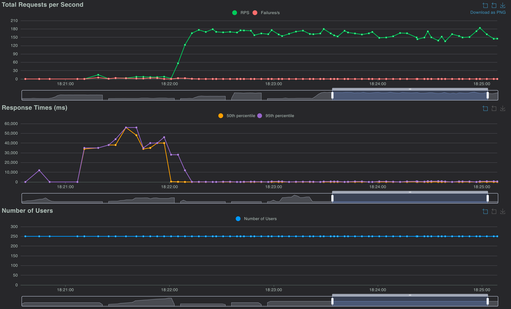
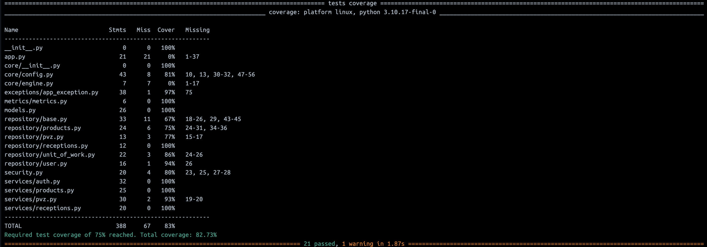
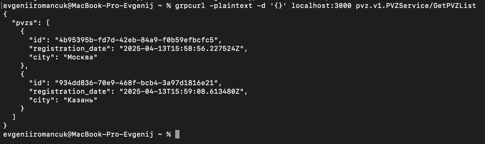

# Avito Shop Service

Backend-сервис для сотрудников пунктов выдачи заказов (ПВЗ) Avito, позволяющий регистрировать приёмки товаров, управлять информацией о товарах и точках выдачи.

## 🚀 Быстрый старт

### 1. Клонируйте репозиторий

```bash
git clone https://github.com/UUyy-Geniy/Backend-trainee-assignment-spring-2025.git
cd avito-shop-service
```

### 2. Запустите проект

```bash
docker-compose up --build
```

После запуска:

- REST API: `http://localhost:8080`
- gRPC-сервер: `localhost:3000`
- Метрики Prometheus: `http://localhost:9000/metrics`
- Нагрузочное тестирование Locust: `http://localhost:8089`
- Adminer (UI для PostgreSQL): `http://localhost:8800`

## 📦 Используемый стек

- **Язык**: Python 3.10+
- **Web-фреймворк**: FastAPI
- **gRPC**: grpcio, protobuf
- **БД**: PostgreSQL
- **Миграции**: Alembic
- **Метрики**: Prometheus
- **Нагрузочное тестирование**: Locust
- **Сборка и запуск**: Docker, Docker Compose
- **Code Style & Tools**: Ruff, Black, pre-commit

---

## 🔐 Авторизация

Два способа:

- `/dummyLogin` — получение токена по типу пользователя (employee/moderator)
- `/register` + `/login` — регистрация по email/паролю

**Важно**: токен передаётся в заголовке:

```
Authorization: Bearer <token>
```

---

## 📊 Метрики Prometheus

Доступны по адресу `http://localhost:9000/metrics`.

### Технические:

- `http_requests_total` — количество HTTP-запросов
- `http_request_duration_seconds` — время отклика

### Бизнесовые:

- `pvz_created_total` — созданные ПВЗ
- `receptions_created_total` — приёмки
- `products_added_total` — добавленные товары


---

## 📈 Нагрузочное тестирование

Локально доступно по адресу: `http://localhost:8089`  
Файл сценария: `tests/load_test/locustfile.py`


---

## 🧪 Тестирование

### Запуск unit и интеграционного тестов

```bash
python -m pytest --cov=.
```

- Покрытие: ≥ 75%



---

## 🔧 Разработка

Перед коммитами работают линтеры и автоформаттеры:

```bash
pre-commit install
```

---


## gRPC сервис 

Для тестирования работы

```bash
brew install grpcurl
```
Проверка списка методов
```bash
grpcurl -plaintext localhost:3000 list
```
Пример вызова метода GetPVZList
```bash
grpcurl -plaintext -d '{}' localhost:3000 pvz.v1.PVZService/GetPVZList
```



## 📎 Полезные ссылки

- Swagger (документация API): `http://localhost:8080/docs`

---
